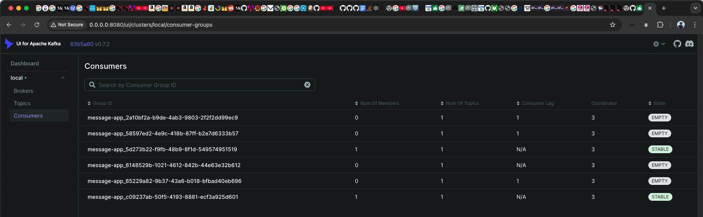

```java
import io.micronaut.configuration.kafka.annotation.KafkaListener;
import io.micronaut.configuration.kafka.annotation.Topic;

@KafkaListener(groupId = "message-app", uniqueGroupId = true, uniqueGroupIdDeleteOnShutdown = true)
public class KafkaMessageConsumerClient {
	@Topic("user-online")
	void consumeEvent(String message) {
		System.out.println("event from Kafka: " + message);
	}
}
```



     __  __ _                                  _   
    |  \/  (_) ___ _ __ ___  _ __   __ _ _   _| |_
    | |\/| | |/ __| '__/ _ \| '_ \ / _` | | | | __|
    | |  | | | (__| | | (_) | | | | (_| | |_| | |_
    |_|  |_|_|\___|_|  \___/|_| |_|\__,_|\__,_|\__|
    01:03:32.380 [main] INFO  o.a.k.c.admin.AdminClientConfig - AdminClientConfig values:
    auto.include.jmx.reporter = true
    bootstrap.controllers = []
    bootstrap.servers = [0.0.0.0:29092, 0.0.0.0:29093, 0.0.0.0:29094]
    client.dns.lookup = use_all_dns_ips
    client.id =
    connections.max.idle.ms = 300000
    default.api.timeout.ms = 60000
    enable.metrics.push = true
    metadata.max.age.ms = 300000
    metadata.recovery.strategy = none
    metric.reporters = []
    metrics.num.samples = 2
    metrics.recording.level = INFO
    metrics.sample.window.ms = 30000
    receive.buffer.bytes = 65536
    reconnect.backoff.max.ms = 1000
    reconnect.backoff.ms = 50
    request.timeout.ms = 30000
    retries = 2147483647
    retry.backoff.max.ms = 1000
    retry.backoff.ms = 100
    sasl.client.callback.handler.class = null
    sasl.jaas.config = null
    sasl.kerberos.kinit.cmd = /usr/bin/kinit
    sasl.kerberos.min.time.before.relogin = 60000
    sasl.kerberos.service.name = null
    sasl.kerberos.ticket.renew.jitter = 0.05
    sasl.kerberos.ticket.renew.window.factor = 0.8
    sasl.login.callback.handler.class = null
    sasl.login.class = null
    sasl.login.connect.timeout.ms = null
    sasl.login.read.timeout.ms = null
    sasl.login.refresh.buffer.seconds = 300
    sasl.login.refresh.min.period.seconds = 60
    sasl.login.refresh.window.factor = 0.8
    sasl.login.refresh.window.jitter = 0.05
    sasl.login.retry.backoff.max.ms = 10000
    sasl.login.retry.backoff.ms = 100
    sasl.mechanism = GSSAPI
    sasl.oauthbearer.clock.skew.seconds = 30
    sasl.oauthbearer.expected.audience = null
    sasl.oauthbearer.expected.issuer = null
    sasl.oauthbearer.jwks.endpoint.refresh.ms = 3600000
    sasl.oauthbearer.jwks.endpoint.retry.backoff.max.ms = 10000
    sasl.oauthbearer.jwks.endpoint.retry.backoff.ms = 100
    sasl.oauthbearer.jwks.endpoint.url = null
    sasl.oauthbearer.scope.claim.name = scope
    sasl.oauthbearer.sub.claim.name = sub
    sasl.oauthbearer.token.endpoint.url = null
    security.protocol = PLAINTEXT
    security.providers = null
    send.buffer.bytes = 131072
    socket.connection.setup.timeout.max.ms = 30000
    socket.connection.setup.timeout.ms = 10000
    ssl.cipher.suites = null
    ssl.enabled.protocols = [TLSv1.2, TLSv1.3]
    ssl.endpoint.identification.algorithm = https
    ssl.engine.factory.class = null
    ssl.key.password = null
    ssl.keymanager.algorithm = SunX509
    ssl.keystore.certificate.chain = null
    ssl.keystore.key = null
    ssl.keystore.location = null
    ssl.keystore.password = null
    ssl.keystore.type = JKS
    ssl.protocol = TLSv1.3
    ssl.provider = null
    ssl.secure.random.implementation = null
    ssl.trustmanager.algorithm = PKIX
    ssl.truststore.certificates = null
    ssl.truststore.location = null
    ssl.truststore.password = null
    ssl.truststore.type = JKS
    
    01:03:32.489 [main] INFO  o.a.kafka.common.utils.AppInfoParser - Kafka version: 3.8.1
    01:03:32.490 [main] INFO  o.a.kafka.common.utils.AppInfoParser - Kafka commitId: 70d6ff42debf7e17
    01:03:32.490 [main] INFO  o.a.kafka.common.utils.AppInfoParser - Kafka startTimeMs: 1738263812489
    01:03:32.583 [main] INFO  o.a.k.c.consumer.ConsumerConfig - ConsumerConfig values:
    allow.auto.create.topics = true
    auto.commit.interval.ms = 5000
    auto.include.jmx.reporter = true
    auto.offset.reset = latest
    bootstrap.servers = [0.0.0.0:29092, 0.0.0.0:29093, 0.0.0.0:29094]
    check.crcs = true
    client.dns.lookup = use_all_dns_ips
    client.id = kafkaconsumerpoc-kafka-message-consumer-client
    client.rack =
    connections.max.idle.ms = 540000
    default.api.timeout.ms = 60000
    enable.auto.commit = true
    enable.metrics.push = true
    exclude.internal.topics = true
    fetch.max.bytes = 52428800
    fetch.max.wait.ms = 500
    fetch.min.bytes = 1
    group.id = message-app_4ead38fc-3ffa-414a-aa54-6d075f26ba82
    group.instance.id = null
    group.protocol = classic
    group.remote.assignor = null
    heartbeat.interval.ms = 3000
    interceptor.classes = []
    internal.leave.group.on.close = true
    internal.throw.on.fetch.stable.offset.unsupported = false
    isolation.level = read_uncommitted
    key.deserializer = class org.apache.kafka.common.serialization.ByteArrayDeserializer
    max.partition.fetch.bytes = 1048576
    max.poll.interval.ms = 300000
    max.poll.records = 500
    metadata.max.age.ms = 300000
    metadata.recovery.strategy = none
    metric.reporters = []
    metrics.num.samples = 2
    metrics.recording.level = INFO
    metrics.sample.window.ms = 30000
    partition.assignment.strategy = [class org.apache.kafka.clients.consumer.RangeAssignor, class org.apache.kafka.clients.consumer.CooperativeStickyAssignor]
    receive.buffer.bytes = 65536
    reconnect.backoff.max.ms = 1000
    reconnect.backoff.ms = 50
    request.timeout.ms = 30000
    retry.backoff.max.ms = 1000
    retry.backoff.ms = 100
    sasl.client.callback.handler.class = null
    sasl.jaas.config = null
    sasl.kerberos.kinit.cmd = /usr/bin/kinit
    sasl.kerberos.min.time.before.relogin = 60000
    sasl.kerberos.service.name = null
    sasl.kerberos.ticket.renew.jitter = 0.05
    sasl.kerberos.ticket.renew.window.factor = 0.8
    sasl.login.callback.handler.class = null
    sasl.login.class = null
    sasl.login.connect.timeout.ms = null
    sasl.login.read.timeout.ms = null
    sasl.login.refresh.buffer.seconds = 300
    sasl.login.refresh.min.period.seconds = 60
    sasl.login.refresh.window.factor = 0.8
    sasl.login.refresh.window.jitter = 0.05
    sasl.login.retry.backoff.max.ms = 10000
    sasl.login.retry.backoff.ms = 100
    sasl.mechanism = GSSAPI
    sasl.oauthbearer.clock.skew.seconds = 30
    sasl.oauthbearer.expected.audience = null
    sasl.oauthbearer.expected.issuer = null
    sasl.oauthbearer.jwks.endpoint.refresh.ms = 3600000
    sasl.oauthbearer.jwks.endpoint.retry.backoff.max.ms = 10000
    sasl.oauthbearer.jwks.endpoint.retry.backoff.ms = 100
    sasl.oauthbearer.jwks.endpoint.url = null
    sasl.oauthbearer.scope.claim.name = scope
    sasl.oauthbearer.sub.claim.name = sub
    sasl.oauthbearer.token.endpoint.url = null
    security.protocol = PLAINTEXT
    security.providers = null
    send.buffer.bytes = 131072
    session.timeout.ms = 45000
    socket.connection.setup.timeout.max.ms = 30000
    socket.connection.setup.timeout.ms = 10000
    ssl.cipher.suites = null
    ssl.enabled.protocols = [TLSv1.2, TLSv1.3]
    ssl.endpoint.identification.algorithm = https
    ssl.engine.factory.class = null
    ssl.key.password = null
    ssl.keymanager.algorithm = SunX509
    ssl.keystore.certificate.chain = null
    ssl.keystore.key = null
    ssl.keystore.location = null
    ssl.keystore.password = null
    ssl.keystore.type = JKS
    ssl.protocol = TLSv1.3
    ssl.provider = null
    ssl.secure.random.implementation = null
    ssl.trustmanager.algorithm = PKIX
    ssl.truststore.certificates = null
    ssl.truststore.location = null
    ssl.truststore.password = null
    ssl.truststore.type = JKS
    value.deserializer = class org.apache.kafka.common.serialization.StringDeserializer
    
    01:03:32.606 [main] INFO  o.a.k.c.t.i.KafkaMetricsCollector - initializing Kafka metrics collector
    01:03:32.636 [main] INFO  o.a.kafka.common.utils.AppInfoParser - Kafka version: 3.8.1
    01:03:32.636 [main] INFO  o.a.kafka.common.utils.AppInfoParser - Kafka commitId: 70d6ff42debf7e17
    01:03:32.636 [main] INFO  o.a.kafka.common.utils.AppInfoParser - Kafka startTimeMs: 1738263812636
    01:03:32.638 [main] INFO  o.a.k.c.c.i.LegacyKafkaConsumer - [Consumer clientId=kafkaconsumerpoc-kafka-message-consumer-client, groupId=message-app_4ead38fc-3ffa-414a-aa54-6d075f26ba82] Subscribed to topic(s): user-online
    01:03:32.638 [main] INFO  i.m.c.k.p.KafkaConsumerProcessor - Kafka listener [KafkaMessageConsumerClient#consumeEvent] subscribed to topics: [user-online]
    01:03:32.655 [main] INFO  i.m.c.k.p.KafkaConsumerGroupManager - Registered consumer with client ID 'kafkaconsumerpoc-kafka-message-consumer-client' for group deletion on shutdown.
    01:03:32.655 [main] INFO  i.m.c.k.p.KafkaConsumerGroupManager - Registered consumer group ID for deletion: message-app_4ead38fc-3ffa-414a-aa54-6d075f26ba82
    01:03:32.669 [pool-1-thread-1] INFO  i.m.c.k.p.KafkaConsumerProcessor - Consumer [kafkaconsumerpoc-kafka-message-consumer-client] assignments changed: null -> []
    01:03:32.718 [pool-1-thread-1] INFO  org.apache.kafka.clients.Metadata - [Consumer clientId=kafkaconsumerpoc-kafka-message-consumer-client, groupId=message-app_4ead38fc-3ffa-414a-aa54-6d075f26ba82] Cluster ID: m7fc21-pQ9qaCHCez19b2w
    01:03:32.740 [pool-1-thread-1] INFO  o.a.k.c.c.i.ConsumerCoordinator - [Consumer clientId=kafkaconsumerpoc-kafka-message-consumer-client, groupId=message-app_4ead38fc-3ffa-414a-aa54-6d075f26ba82] Discovered group coordinator localhost:29094 (id: 2147483644 rack: null)
    01:03:32.749 [pool-1-thread-1] INFO  o.a.k.c.c.i.ConsumerCoordinator - [Consumer clientId=kafkaconsumerpoc-kafka-message-consumer-client, groupId=message-app_4ead38fc-3ffa-414a-aa54-6d075f26ba82] (Re-)joining group
    01:03:32.761 [pool-1-thread-1] INFO  o.a.k.c.c.i.ConsumerCoordinator - [Consumer clientId=kafkaconsumerpoc-kafka-message-consumer-client, groupId=message-app_4ead38fc-3ffa-414a-aa54-6d075f26ba82] Request joining group due to: need to re-join with the given member-id: kafkaconsumerpoc-kafka-message-consumer-client-e0cdee6a-5398-4284-830e-456e0ef82e5e
    01:03:32.762 [pool-1-thread-1] INFO  o.a.k.c.c.i.ConsumerCoordinator - [Consumer clientId=kafkaconsumerpoc-kafka-message-consumer-client, groupId=message-app_4ead38fc-3ffa-414a-aa54-6d075f26ba82] (Re-)joining group
    01:03:32.883 [main] INFO  io.micronaut.runtime.Micronaut - Startup completed in 718ms. Server Running: http://localhost:8081
    01:03:35.766 [pool-1-thread-1] INFO  o.a.k.c.c.i.ConsumerCoordinator - [Consumer clientId=kafkaconsumerpoc-kafka-message-consumer-client, groupId=message-app_4ead38fc-3ffa-414a-aa54-6d075f26ba82] Successfully joined group with generation Generation{generationId=1, memberId='kafkaconsumerpoc-kafka-message-consumer-client-e0cdee6a-5398-4284-830e-456e0ef82e5e', protocol='range'}
    01:03:35.778 [pool-1-thread-1] INFO  o.a.k.c.c.i.ConsumerCoordinator - [Consumer clientId=kafkaconsumerpoc-kafka-message-consumer-client, groupId=message-app_4ead38fc-3ffa-414a-aa54-6d075f26ba82] Finished assignment for group at generation 1: {kafkaconsumerpoc-kafka-message-consumer-client-e0cdee6a-5398-4284-830e-456e0ef82e5e=Assignment(partitions=[user-online-0])}
    01:03:35.802 [pool-1-thread-1] INFO  o.a.k.c.c.i.ConsumerCoordinator - [Consumer clientId=kafkaconsumerpoc-kafka-message-consumer-client, groupId=message-app_4ead38fc-3ffa-414a-aa54-6d075f26ba82] Successfully synced group in generation Generation{generationId=1, memberId='kafkaconsumerpoc-kafka-message-consumer-client-e0cdee6a-5398-4284-830e-456e0ef82e5e', protocol='range'}
    01:03:35.803 [pool-1-thread-1] INFO  o.a.k.c.c.i.ConsumerCoordinator - [Consumer clientId=kafkaconsumerpoc-kafka-message-consumer-client, groupId=message-app_4ead38fc-3ffa-414a-aa54-6d075f26ba82] Notifying assignor about the new Assignment(partitions=[user-online-0])
    01:03:35.808 [pool-1-thread-1] INFO  o.a.k.c.c.i.ConsumerRebalanceListenerInvoker - [Consumer clientId=kafkaconsumerpoc-kafka-message-consumer-client, groupId=message-app_4ead38fc-3ffa-414a-aa54-6d075f26ba82] Adding newly assigned partitions: user-online-0
    01:03:35.819 [pool-1-thread-1] INFO  o.a.k.c.c.i.ConsumerCoordinator - [Consumer clientId=kafkaconsumerpoc-kafka-message-consumer-client, groupId=message-app_4ead38fc-3ffa-414a-aa54-6d075f26ba82] Found no committed offset for partition user-online-0
    01:03:35.826 [pool-1-thread-1] INFO  i.m.c.k.p.KafkaConsumerProcessor - Consumer [kafkaconsumerpoc-kafka-message-consumer-client] assignments changed: [] -> [user-online-0]
    01:03:35.837 [pool-1-thread-1] INFO  o.a.k.c.c.i.SubscriptionState - [Consumer clientId=kafkaconsumerpoc-kafka-message-consumer-client, groupId=message-app_4ead38fc-3ffa-414a-aa54-6d075f26ba82] Resetting offset for partition user-online-0 to position FetchPosition{offset=35, offsetEpoch=Optional.empty, currentLeader=LeaderAndEpoch{leader=Optional[localhost:29094 (id: 3 rack: null)], epoch=12}}.
    01:03:51.523 [Thread-0] INFO  io.micronaut.runtime.Micronaut - Embedded Application shutting down
    01:03:51.529 [Thread-0] INFO  i.m.c.k.p.KafkaConsumerGroupManager - Application shutdown initiated. Preparing to delete registered Kafka unique consumer groups.
    01:03:51.529 [Thread-0] INFO  i.m.c.k.p.KafkaConsumerGroupManager - Closing 1 consumers and attempting to delete the following consumer groups: [message-app_4ead38fc-3ffa-414a-aa54-6d075f26ba82]
    01:03:51.529 [Thread-0] INFO  i.m.c.k.p.KafkaConsumerGroupManager - Closing all registered Kafka consumers who has unique group id.
    01:03:51.534 [pool-1-thread-1] INFO  o.a.k.c.c.i.ConsumerRebalanceListenerInvoker - [Consumer clientId=kafkaconsumerpoc-kafka-message-consumer-client, groupId=message-app_4ead38fc-3ffa-414a-aa54-6d075f26ba82] Revoke previously assigned partitions user-online-0
    01:03:51.534 [pool-1-thread-1] INFO  o.a.k.c.c.i.ConsumerCoordinator - [Consumer clientId=kafkaconsumerpoc-kafka-message-consumer-client, groupId=message-app_4ead38fc-3ffa-414a-aa54-6d075f26ba82] Member kafkaconsumerpoc-kafka-message-consumer-client-e0cdee6a-5398-4284-830e-456e0ef82e5e sending LeaveGroup request to coordinator localhost:29094 (id: 2147483644 rack: null) due to the consumer is being closed
    01:03:51.534 [pool-1-thread-1] INFO  o.a.k.c.c.i.ConsumerCoordinator - [Consumer clientId=kafkaconsumerpoc-kafka-message-consumer-client, groupId=message-app_4ead38fc-3ffa-414a-aa54-6d075f26ba82] Resetting generation and member id due to: consumer pro-actively leaving the group
    01:03:51.534 [pool-1-thread-1] INFO  o.a.k.c.c.i.ConsumerCoordinator - [Consumer clientId=kafkaconsumerpoc-kafka-message-consumer-client, groupId=message-app_4ead38fc-3ffa-414a-aa54-6d075f26ba82] Request joining group due to: consumer pro-actively leaving the group
    01:03:51.996 [pool-1-thread-1] INFO  o.a.kafka.common.metrics.Metrics - Metrics scheduler closed
    01:03:51.997 [pool-1-thread-1] INFO  o.a.kafka.common.metrics.Metrics - Closing reporter org.apache.kafka.common.metrics.JmxReporter
    01:03:51.997 [pool-1-thread-1] INFO  o.a.kafka.common.metrics.Metrics - Closing reporter org.apache.kafka.common.telemetry.internals.ClientTelemetryReporter
    01:03:51.997 [pool-1-thread-1] INFO  o.a.kafka.common.metrics.Metrics - Metrics reporters closed
    01:03:52.001 [pool-1-thread-1] INFO  o.a.kafka.common.utils.AppInfoParser - App info kafka.consumer for kafkaconsumerpoc-kafka-message-consumer-client unregistered
    01:03:52.001 [Thread-0] INFO  i.m.c.k.p.KafkaConsumerGroupManager - All registered Kafka consumers who have unique group IDs have been successfully closed.
    01:03:52.030 [kafka-admin-client-thread | adminclient-1] INFO  i.m.c.k.p.KafkaConsumerGroupManager - Successfully deleted the following consumer groups: [message-app_4ead38fc-3ffa-414a-aa54-6d075f26ba82]
    01:03:52.030 [kafka-admin-client-thread | adminclient-1] INFO  o.a.kafka.common.utils.AppInfoParser - App info kafka.admin.client for adminclient-1 unregistered
    01:03:52.032 [kafka-admin-client-thread | adminclient-1] INFO  o.a.kafka.common.metrics.Metrics - Metrics scheduler closed
    01:03:52.032 [kafka-admin-client-thread | adminclient-1] INFO  o.a.kafka.common.metrics.Metrics - Closing reporter org.apache.kafka.common.metrics.JmxReporter
    01:03:52.032 [kafka-admin-client-thread | adminclient-1] INFO  o.a.kafka.common.metrics.Metrics - Metrics reporters closed