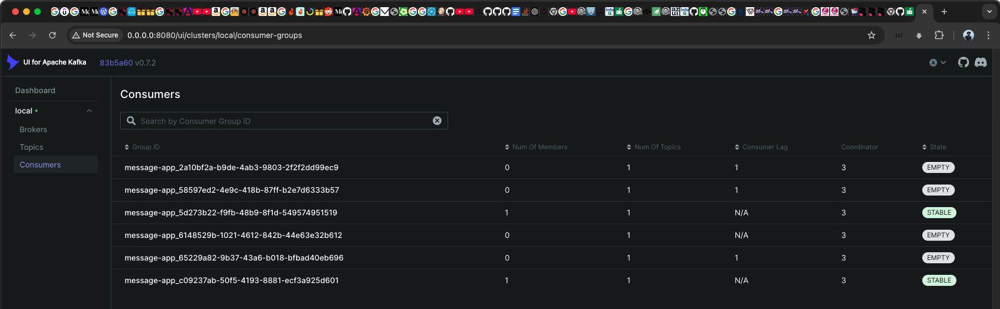

# Uniquely generated groupId remains in Kafka and is not automatically deleted.

A unique consumer group can be created for a Kafka listener by setting uniqueGroupId=true on the @KafkaListener annotation. 
This automatically generates a unique groupId each time the application starts. However, once the application shuts down, 
the generated groupId remains in Kafka and is not automatically deleted.

```java
package org.cm.kafka;

import io.micronaut.configuration.kafka.annotation.KafkaListener;
import io.micronaut.configuration.kafka.annotation.Topic;

@KafkaListener(groupId = "message-app", uniqueGroupId = true)
public class KafkaMessageConsumerClient {
	@Topic("user-online")
	void consumeEvent(String message) {
		System.out.println("event from Kafka: " + message);
	}
}

```

This is the groupId list remains on kafka


Multiple consumer groups support is added on this [https://github.com/micronaut-projects/micronaut-kafka/pull/69).
where a flag is added (uniqueGroupId) in the annotation KafkaListener, if uniqueGroupId is true,
Then the app will create a unique groupID.
However, the generated groupId persists in Kafka even after the application shuts down.

We are currently developing a whiteboard application where each service have multiple instances, and any instance can broadcasts events, 
and all other instances need to receive these event. This follows a pub/sub pattern. 
As this feature is critical for our use case, we want to ensure better manageability by avoiding unnecessary groupId entries in Kafka. 
To address this, I have implemented a quick fix that still relies on annotations to delete newly created groupId will deleted automatically upon application shutdown.
